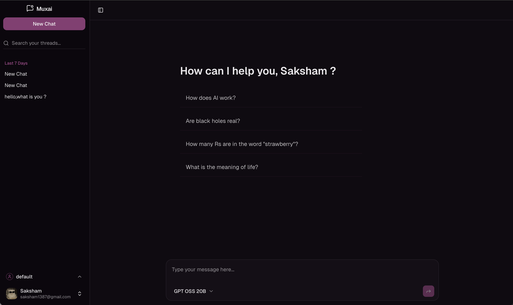

# MuxAI

A minimalist, high-performance AI chat interface supporting multiple models and personalized profiles.

## Features

- **Multi-Model Support**: Seamlessly switch between OpenRouter and Google Gemini models.
- **AI Reasoning**: Specialized UI for displaying model thought processes and reasoning blocks.
- **Smart Profiles**: Create multiple personas with custom system prompts and preferences.
- **Auto-Conversations**: Dynamic conversation creation and intelligent title generation.
- **Rich Markdown**: Full support for code highlighting and formatted text.
- **Responsive Design**: Optimized for both desktop and mobile workflows.
- **Secure Auth**: Built-in authentication and user session management.

## Tech Stack

- **Framework**: Next.js 15 (App Router)
- **Database**: Prisma + PostgreSQL
- **API**: tRPC
- **AI SDK**: Vercel AI SDK
- **Styling**: Tailwind CSS + Shadcn UI
- **Runtime**: Bun / Node.js
